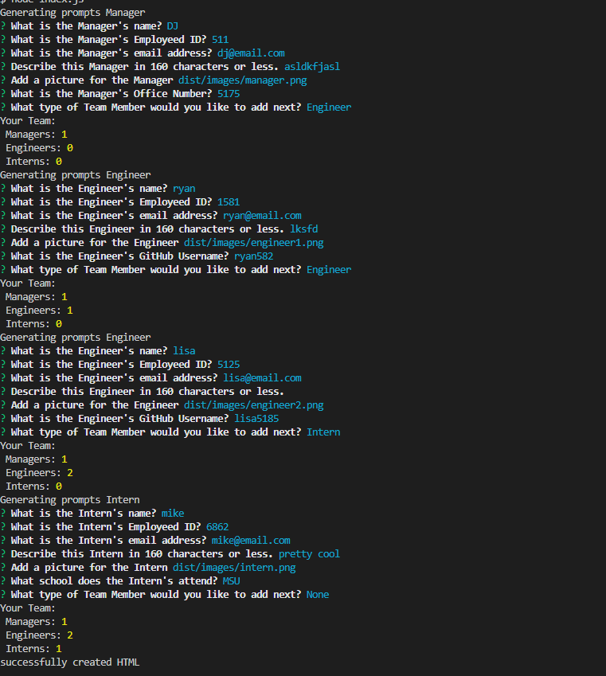

# Team Builder

## Description

Quickly build a webpage with your team's information without leaving your terminal!

## Table of Contents

- [Team Builder](#team-builder)
  - [Description](#description)
  - [Table of Contents](#table-of-contents)
  - [Installation](#installation)
  - [Usage](#usage)
  - [Video](#video)
  - [Images](#images)
    - [Image 1](#image-1)
    - [Image 2](#image-2)
  - [Questions](#questions)

## Installation

1. Clone repo.
2. Run npm i

## Usage

To use this appliction, simply run "node index.js" and answer the prompts. You can then open the index.html file located in the /dist folder

## Video

[Example Video](https://drive.google.com/file/d/1NoFdHaxPF6bj_HWb3932VAxm5GTKkXTY/view "Example Video")

## Images

### Image 1

### Image 2

## Questions

[My GitHub Profile](https://github.com/Deejerz88)

If you have any questions about my project, please contact me at [djmcmillan93@gmail.com](mailto:djmcmillan93@gmail.com).
